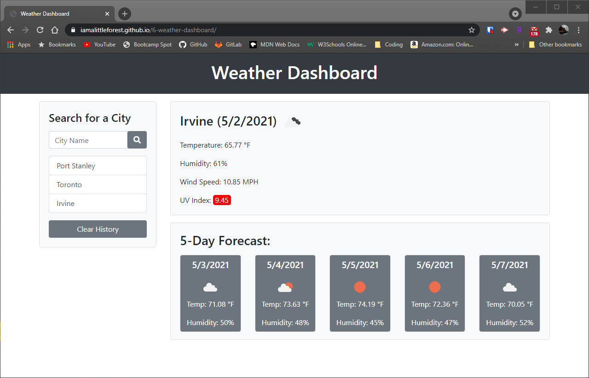

# Weather Dashboard

## Link
https://iamalittleforest.github.io/6-weather-dashboard/

## Languages & Technologies 
* HTML / CSS / Javascript
* Bootstrap
* jQuery, jQuery UI
* Moment.js 
* Open Weather Map API

## Description
This application enables users to view the current weather and future forecast for a city they search for. Users can also select cities from their search history to view the current weather and future forecast for that city. This application runs in the browser and features dynamically updated HTML and CSS that is powered by Javascript.

## Screenshot

## Demo

## License
MIT License

## Contact Information
Wendy Kobayashi (<wykobayashi@gmail.com>)
